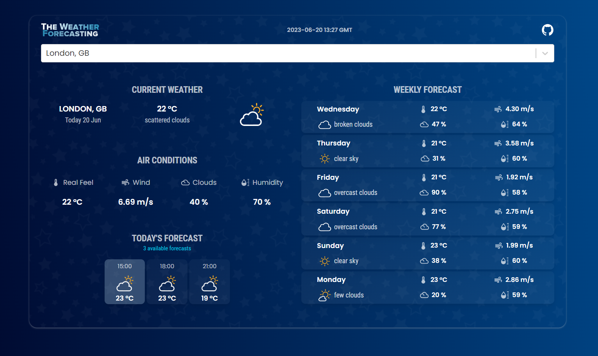

# 🌦️ SkyCast - Weather Forecast Application



A modern and responsive weather forecasting application built with React.js and Material UI.

Users can search for cities around the world and view current weather conditions, air conditions, hourly forecasts, and multi-day weather forecasts.

## 🚀 Live Demo

https://skycast-weather-info.vercel.app

## ✨ Features

- Search weather information by city name
- Current temperature and weather conditions
- Real Feel temperature
- Wind speed
- Cloud percentage
- Humidity information
- 3-hour interval weather forecast
- Multi-day weather forecast
- Dynamic weather icons
- Loading and error handling
- Responsive design for mobile, tablet, and desktop devices
- GMT date and time display
- Clean and modern user interface

## 🛠️ Technologies Used

- React.js
- JavaScript
- Material UI
- OpenWeather API
- GeoDB Cities API
- React Select Async Paginate
- CSS

## 📂 Project Structure

```text
src/
│
├── api/
│   └── OpenWeatherService.js
│
├── assets/
│
├── components/
│   ├── Reusable/
│   ├── Search/
│   ├── TodayWeather/
│   └── WeeklyForecast/
│
├── utilities/
│   ├── DataUtils.js
│   ├── DateConstants.js
│   ├── DatetimeUtils.js
│   └── IconsUtils.js
│
├── App.js
├── index.js
└── index.css
```

## ⚡ Getting Started

Follow these steps to run the project locally.

### 1. Clone the Repository

```bash
git clone https://github.com/saurav-09/weather-app
```

Move into the project directory:

```bash
cd YOUR_PROJECT_FOLDER_NAME
```

### 2. Install Dependencies

```bash
npm install
```

### 3. Create Environment Variables

Create a `.env` file in the root directory of the project.

```text
REACT_APP_WEATHER_API_KEY=your_openweather_api_key
REACT_APP_RAPID_API_KEY=your_rapidapi_key
```

You can get the required API keys from:

- OpenWeather API
- GeoDB Cities API through RapidAPI

> Never commit your `.env` file or API keys to GitHub.

### 4. Start the Application

```bash
npm start
```

The application will run locally in your browser.

## 📱 Responsive Design

The application is designed to work across different screen sizes, including:

- Mobile devices
- Tablets
- Laptops
- Desktop screens

## 🔮 Future Improvements

- Celsius and Fahrenheit conversion
- Automatic weather detection using user location
- Dark and light mode
- Weather charts and data visualization
- Improved city timezone support
- Unit testing
- TypeScript migration

## 👨‍💻 Developer

Developed and improved by **Saurav**.

## 📄 License

This project is created for learning and portfolio purposes.
